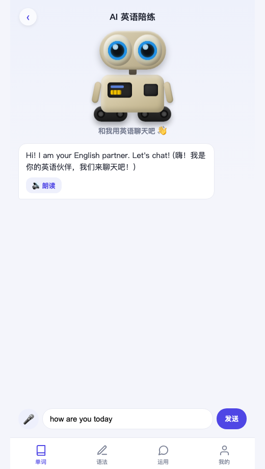

# 英语启蒙 · English Starter 📖

一个为**中文母语、零基础学习者**打造的英语学习 Web App。手机浏览器打开即用，可"添加到主屏幕"当 App 用。纯前端、可离线，外加一个可选的本地 AI 陪练。

<p align="center">
  
</p>

## ✨ 功能

| 模块 | 内容 |
|------|------|
| 📖 **单词** | 牛津 3000 高频核心词（3344 个），含**词性、词形变化、3 条例句、真人发音**，基于 SM-2 记忆曲线安排复习，可搜索的"我的单词"列表 |
| ✍️ **语法** | **44 课** · 11 个单元（be 动词→时态→词类→句型），每课"中文讲解 + 例句 + 小测" |
| 💬 **运用** | 🤖 **AI 英语陪练**：用英语和 AI 聊天、即时纠错、朗读、语音输入（需本地运行，见下文） |
| 👤 **我的** | 连续打卡、学习日历热力图、发音设置（真人/设备语音）、每日提醒 |

机器人形象是会动的 WALL-E（纯 CSS）：平时漂浮眨眼，**听你说话时眼睛变绿、思考时转头、说话时点头发亮**。

## 🚀 在线体验（单词 + 语法）

> 在线版可直接使用**单词、语法、打卡**等纯前端功能。
> **AI 陪练**在线也能用：在 **设置** 里填入你自己的 [Claude API Key](https://console.anthropic.com/settings/keys)（BYOK，仅存在你本机浏览器，用谁的 key 花谁的额度，默认用便宜的 Haiku 模型）。不想用 key 的话，也可在本机运行 `server.py` 走本地 Claude。

👉 **在线地址：** https://gsh-sports.github.io/english-learning-app/

### 🔑 AI 陪练支持的大模型（BYOK · 用谁的 key 花谁的额度）

在 **设置 → AI 陪练** 里选供应商、填你自己的 key。密钥只存在你本机浏览器，浏览器直连模型接口，不经过任何服务器。

**内置（选好直接填 key + 模型名）：**

| 供应商 | 模型名示例 | 获取 key |
|--------|-----------|----------|
| Claude (Anthropic) | `claude-haiku-4-5`、`claude-sonnet-4-6` | <https://console.anthropic.com/settings/keys> |
| DeepSeek (深度求索) | `deepseek-chat`、`deepseek-reasoner` | <https://platform.deepseek.com/api_keys> |
| 通义千问 (阿里) | `qwen-turbo`、`qwen-plus`、`qwen-max` | <https://dashscope.console.aliyun.com/apiKey> |

**自定义（任何 OpenAI 兼容接口都行，选"自定义"填接口地址）：**

| 服务 | 接口地址（base url） | 模型名示例 |
|------|---------------------|-----------|
| 硅基流动 SiliconFlow | `https://api.siliconflow.cn/v1` | `deepseek-ai/DeepSeek-V3` |
| Kimi (月之暗面) | `https://api.moonshot.cn/v1` | `moonshot-v1-8k` |
| 智谱 GLM | `https://open.bigmodel.cn/api/paas/v4` | `glm-4-flash` |
| OpenAI | `https://api.openai.com/v1` | `gpt-4o-mini` |
| Gemini (OpenAI 兼容) | `https://generativelanguage.googleapis.com/v1beta/openai` | `gemini-2.0-flash` |
| 本地 Ollama | `http://localhost:11434/v1` | `qwen2.5` |

> 💡 国内用户推荐 **DeepSeek / 通义千问 / 硅基流动**：访问快、便宜、无需翻墙。
> ⚠️ 要点：① 模型名要填对；② 在线版需供应商支持浏览器跨域（上面列出的均已实测支持）；③ 本地 Ollama 仅在本机访问时可用。

## 💻 本地完整运行（含 AI 陪练）

AI 陪练通过本地 [Claude Code](https://claude.com/claude-code) 的无头模式（`claude -p`）实现——**无需 API 密钥**，用你本机已登录的 Claude。

```bash
git clone https://github.com/gsh-sports/english-learning-app.git
cd english-learning-app
python3 server.py          # 启动本地后端（默认 8000 端口）
# 浏览器打开 http://localhost:8000
```

- 仅用单词/语法：任意静态服务器即可（如 `python3 -m http.server`）。
- 要用 AI 陪练：需安装并登录 Claude Code（命令 `claude` 可用），用上面的 `server.py`。
- 手机访问：手机与电脑同一 WiFi，访问 `http://<电脑局域网IP>:8000`（麦克风语音输入受浏览器安全限制，仅 https/localhost 可用）。

`server.py` 还能**用环境变量里的密钥代理 DeepSeek / 通义千问**（服务端调用，浏览器里不用填 key）：

```bash
export DEEPSEEK_API_KEY=sk-xxx      # 想用 DeepSeek
export DASHSCOPE_API_KEY=sk-xxx     # 想用 通义千问
python3 server.py
# 然后在 App 的"设置"里选 DeepSeek / 通义千问，密钥留空即可（走本地代理）
```

> 三种 AI 后端并存：在"设置"里填了某家的 key → 浏览器直连那家；key 留空 → 回退到 `server.py`（claude 用本地 Claude Code；deepseek/qwen 用上面的环境变量密钥）。

## 🛠 重新构建数据（可选）

仓库已包含构建好的数据（`words.js` / `examples.js` / `grammar.js`），开箱即用。若要从头重建：

```bash
# 1. 下载 ECDICT 词库（63MB，不入库）
curl -L -o ecdict.csv https://raw.githubusercontent.com/skywind3000/ECDICT/master/ecdict.csv

pip3 install zhconv
python3 build_words.py      # 筛词 → words.js
python3 build_examples.py   # 拉 Tatoeba 例句 → examples_tatoeba.json
python3 build_merge.py      # 合并 AI + Tatoeba 例句 → examples.js
python3 clean_examples.py   # 清洗朗读不友好的句子
```

## 📚 数据来源与致谢

- **[ECDICT](https://github.com/skywind3000/ECDICT)** — 开源英汉词典，提供单词、音标、释义、词频、词形变化。MIT License。
- **[Tatoeba](https://tatoeba.org)** — 真实例句来源。例句采用 **CC BY 2.0 FR** 协议，归属 Tatoeba 及其贡献者。
- **有道词典发音接口** — 单词/句子真人发音（`dictvoice`）。非官方公开 API，仅用于学习。
- **AI 例句 & 语法课**由 Claude 生成并经人工校对。

## 📄 许可证

代码采用 [MIT License](LICENSE)。第三方数据遵循其各自协议（见上）。

---

*用 [Claude Code](https://claude.com/claude-code) 构建。*
